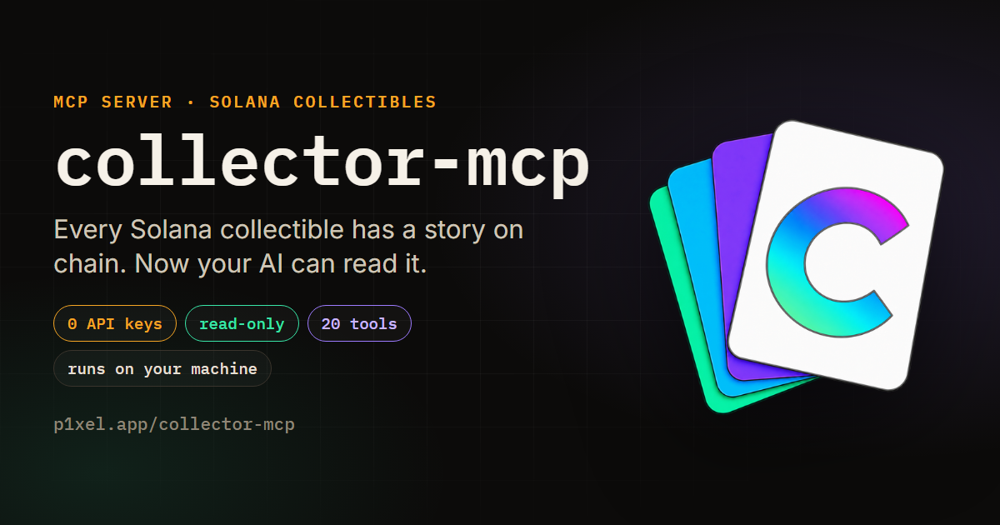

<div align="center">



# collector-mcp

**Every Solana collectible has a story on chain. Most tools cannot read it, and an AI asked cold will grind through tokens and costly mistakes on the way to the truth, or just make one up.** collector-mcp gets to the truth for Solana collectors: who owned it, who can freeze it, what sold and for how much, and where the deals are. Read-only, no API keys, nothing collected, runs on your machine.

[](tsconfig.json)
[](https://modelcontextprotocol.io)
[](LICENSE)
[](#what-it-reads)

</div>

---

## Why

Ask an assistant about a Solana card today and it answers from memory. It will report that a
card "never traded", because the mainstream enhanced-transaction APIs return an empty history
for Metaplex Core assets while the transfers sit on chain the whole time. It will put a SOL
floor next to a USDC floor and call one of them 170x the other. It will multiply a floor by an
item count and call the result a portfolio value.

collector-mcp hands the same assistant live, labelled data instead: the chain for supply,
ownership, provenance and custody rules, Magic Eden without a key, and OpenSea
through a free key the server issues itself. Each number comes back with its venue, its currency, its read time, and what the
source could not see.

## Install

Requires Node 20 or newer. Build once:

```bash
git clone https://github.com/p1xelapp/collector-mcp.git
cd collector-mcp && npm install && npm run build
```

### Claude Code

```bash
claude mcp add collector -- node /absolute/path/to/collector-mcp/dist/index.js
```

### Claude Desktop

Settings -> Developer -> Edit Config, then add:

```json
{
  "mcpServers": {
    "collector": {
      "command": "node",
      "args": ["/absolute/path/to/collector-mcp/dist/index.js"]
    }
  }
}
```

Quit the app fully and reopen it.

### Every other MCP client

Cursor, Windsurf, Codex CLI, Gemini CLI, Zed, Cline and VS Code take the same `command` /
`args` pair in their own MCP config. The server speaks stdio and holds no client-specific
code, so anything that can launch a local process will run it. ChatGPT on the web and Grok
cannot: they have nowhere to run a local server.

### Did it work?

Most apps list the tools under a small icon near the message box; Claude Code shows them with
`/mcp`. You should see 20 tools, starting with `identify`. If you see none: the path in the
config must be absolute and must point at `dist/index.js`, `npm run build` must have been run,
and the app must be fully quit and reopened, tray icon included.

### Optional: OpenSea

Solana collections have traded on OpenSea since 31 Aug 2026, with Candy Digital among the
launch partners. OpenSea adds second-venue floors, sales, supply and royalty per collection,
plain transfers per wallet (how airdrops and gifts become visible), and a searchable index of
every Solana collection OpenSea lists.

You do not have to know a collection's OpenSea slug. It is found from the collection's
on-chain address against OpenSea's own Solana index, and failing that by trying the name and
accepting it only when OpenSea's record for that slug carries the same chain address. Pass
`openseaSlug` yourself to override. When neither path finds one, the answer says the second
venue was not read and why, which is a gap in what was searched rather than evidence the
collection is absent from OpenSea.

There is nothing to sign up for. The first time a question needs OpenSea, the server asks
OpenSea for one of its free agent keys and stores it in `~/.collector-mcp/opensea-key.json` on
your own machine, renewing it before it expires. The key stays in that file: never logged,
never printed into an answer, and never requested at all by a session that asks no OpenSea
question. OpenSea caps new keys at about two a day per IP address, so if yours is refused,
OpenSea stays off and every answer names it as the missing half.

- `OPENSEA_API_KEY` - your own key from the OpenSea developer portal, for when the self-issued
  one cannot be had. It overrides the self-issued key entirely. Put it in the config's `env`
  block rather than the shell, because MCP clients launch the server with a clean environment:

```json
{
  "mcpServers": {
    "collector": {
      "command": "node",
      "args": ["/absolute/path/to/collector-mcp/dist/index.js"],
      "env": { "OPENSEA_API_KEY": "..." }
    }
  }
}
```

- `COLLECTOR_MCP_NO_AUTO_KEYS=1` - never request a key. OpenSea is then off unless you set
  `OPENSEA_API_KEY` yourself.

`SOLANA_RPC_URL` and `DAS_RPC_URL` swap in a private endpoint if one is available, and neither
is required.

## Ask it anything

Nobody types a tool name. These are asked in plain words and the assistant picks the calls.

- Who has owned this card since it was minted, with dates and the marketplaces involved?
- Is it true this card has never traded?
- Can the project still freeze, move or burn what is in my wallet?
- What is in wallet 7HHs3..., and does that wallet flip or hold?
- What is the cheapest Legendary listing in that DC collection right now?
- Any Superman or Batman DC comic #1 or #100 for sale, and are any of them close to floor?
- Which collection is performing best right now on Magic Eden?
- What did Shohei Ohtani cards sell for this week, and how many changed hands?
- Are the Magic Eden and OpenSea floors for this collection even comparable?
- What would it take to build a sales bot on this, and where would it fail quietly?

A collection name, a player name, a card number or a trait is enough to start. Names resolve
against a bundled snapshot of the Magic Eden directory (30,499 collections, refreshed in the
background), against OpenSea's Solana index, and - when those do not produce a single
confident match - by asking Magic Eden about the name directly.

That last step matters more than it sounds. Magic Eden refuses to page past offset 30,000, so
the directory snapshot is a prefix of the venue rather than the whole of it, and the
collections past that ceiling are not obscure ones. Asking it for "DeGods" used to return
eight imitations and not DeGods. A name is now also tried as a symbol against the venue
itself, which has no ceiling, and the answer is accepted only when the venue's own record
confirms it. A single fuzzy match whose name is not what you asked for is offered as a
candidate with the mismatch stated, never presented as the answer.

Answers are also sized to arrive whole. Every client silently truncates a large tool result
and the model then reads the surviving prefix as the complete list, so a long answer drops
per-row detail before it drops rows, and says in the answer what it left out and how to get
it back.

## What it reads

| Source | Answers | Key |
|---|---|---|
| Solana RPC (three public endpoints, rotated) | supply, current owner from decoded Core account bytes, transfer history, wallet age | none |
| Asset index (DAS) on the public RPC | a second, independent opinion on ownership and wallet contents | none |
| Magic Eden v2 | floors, listings, sales, activity, top traders, trending | none |
| OpenSea v2 | second-venue floors, sales, supply, royalty, wallet transfers | self-issued |

No account, no sign-in, no telemetry, no analytics, no log of your questions. There is no signing
code in the repository, so transacting was never written rather than merely disabled, and every
tool declares `readOnlyHint` in the protocol.

Precisely what leaves the machine, and nothing else:

- The public address, symbol or name you asked about, sent to the public source that can answer
  it: Solana RPC, the asset index, Magic Eden, and OpenSea when it is on.
- One request to `registry.npmjs.org` at startup to see whether a newer version exists. It sends
  the package name and the version you are running as a user-agent, and nothing about you or your
  question. Turn it off with `COLLECTOR_MCP_NO_UPDATE_CHECK=1`, or `COLLECTOR_MCP_OFFLINE=1` to
  stop every background request.
- One request to OpenSea to issue a free agent key, made only the first time a question actually
  needs OpenSea, and not at all if you set `OPENSEA_API_KEY` yourself or
  `COLLECTOR_MCP_NO_AUTO_KEYS=1`.

One file is written on your machine: `~/.collector-mcp/opensea-key.json`, holding that self-issued
key at permissions 600. It is never logged and never printed into an answer. Nothing else is
stored, and no question you ask is written anywhere.

## Tools

20 tools. Names are frozen: agents reference them in prompts, and a rename breaks integrations
without raising an error.

| Tool | Back |
|---|---|
| `identify` | what an address or name is, where it trades, which tool to call next |
| `verify_claim` | confirmed, contradicted or unverifiable, with the numbers seen and how to re-check |
| `get_asset_trust` | Core plugins decoded from bytes: delegates, frozen state, enforced vs advisory royalties, mutable metadata, editions |
| `get_integration_recipe` | endpoints, pacing, running cost, skeleton and the silent failure modes for a given build |
| `search_collections` | name lookup across the Magic Eden directory and the OpenSea Solana index, saying which layers were read |
| `get_collection_stats` | chain supply, floors per venue, and a reconciliation that refuses to rank SOL against USDC |
| `get_floor_prices` | current floor and listed count for up to 10 collections, Magic Eden only (cross-venue floors live in `get_collection_stats`) |
| `get_recent_sales` | latest completed fills with buyer, seller, price and signature |
| `get_asset` | three readers for one item: the venue, a byte-level decode, and the chain's asset index, with owner agreement reported |
| `get_asset_provenance` | bounded ownership history of a Core asset, dated, marketplaces named - `historyComplete` says whether it reached the mint |
| `get_wallet_holdings` | holdings from two independent readers, with the gap between them named |
| `get_wallet_profile` | holdings by collection, share of wallet and of supply, listed and compressed counts, floor ceiling with assumptions, wallet age |
| `get_wallet_activity` | buys and sells, net flow, venue split, every flip with hold time and P&L, realized totals, a behaviour label with its reason |
| `get_collection_sales` | sales over a window: count, volume, top and bottom sale, median, buyers, sellers, per-day series, a per-name breakdown (which player or character sold most), a name filter, how far back the feed was read |
| `find_in_group` | one edition number hunted across a whole family of collections, each match against that collection's own floor, with a cursor for the rest |
| `find_listings` | cheapest-first listings, trait filters combined with AND, name filter, a lowest-serials mode for #1 and #100 hunters, each ask against its trait floor |
| `get_top_traders` | the largest wallets in a collection by Magic Eden volume, all time |
| `get_trending` | Magic Eden's trending list, with an explicit note when the venue publishes nothing |
| `explain_mechanics` | escrow, freezing, delegates, royalties, wash trades and migrations, per standard and venue, each entry citing its source |
| `get_source_status` | every source pinged live: tier, fallback, what it cannot see, which need a key |

## Prompts

Three, and none of them asks you to fill in a box. `getting_started` says what the server
answers and hands you five questions to try. `collection_report` and `wallet_report` ask which
collection or wallet you mean and then run the whole sequence: identifiers, supply, floor, what
actually sold, and one item's story.

There are deliberately no MCP resources. A client shows those to you as files to attach beside
your message, and nobody wants to attach a glossary to ask what a card is worth. Everything they
used to carry is reachable by a tool the assistant calls on its own: `explain_mechanics` for how
a standard or a venue behaves and for the vocabulary (ask it for "glossary" to get all of it
with the rules for presenting this data), `get_source_status` for the source catalog, and
`search_collections` for the collection registry.

## Trust and limits

- Buying, selling, listing and signing are absent. No code exists for them.
- Provenance and trust decoding cover Metaplex Core only. Legacy SPL and compressed NFTs are
  reported as named gaps, never as empty lists. Holdings and activity cover both.
- Magic Eden and OpenSea only, for venue data. Tensor has no self-serve API keys. Rarible's
  Solana API needs a key on a 100-request-a-month free tier and cannot say that a fill happened
  on Magic Eden, which is the mislabelling this server exists to avoid. Both sit in the source
  catalog as planned, with the condition that would add them.
- Solana only. Keyless indexed NFT data on other chains went away with Reservoir and SimpleHash.
- No valuations and no currency conversion. A floor-times-count figure is returned as a ceiling
  with its assumptions attached, because a stale price feed is wrong with the same confidence as
  a good one.
- Sales history reaches as far as the venue keeps it, and the result says how far it got.
  Ownership history for Core assets comes from the chain and is bounded by `depth`: the result
  carries `historyComplete` and `skippedTransactions`, so a partial trail is never presented as
  the whole story.
- Public RPC throttles bursts, and cached values come back labelled `stale: true` rather than
  erroring mid-conversation. Full detail in [docs/TRUST-AND-LIMITS.md](docs/TRUST-AND-LIMITS.md)
  and [docs/SOURCES.md](docs/SOURCES.md).

## Security

Minting is permissionless, so a collection name is attacker-controlled text. Every name from a
chain or a marketplace is neutralised before a model sees it: invisible and bidi characters
stripped, newlines collapsed, delimiter markup defanged, instruction-shaped phrasing flagged.
This is covered by the offline test suite. Reporting: [SECURITY.md](SECURITY.md).

## Development

```bash
npm test           # offline: every tool, prompt, validation, wallet and market logic
                   # on captured feeds, plus the prompt-injection defence. No network at all.
npm run test:live  # live: floors, a real provenance trace, source status per family, name lookup
npm run test:smoke # live: every tool against real endpoints, a real wallet, hostile inputs
npm run snapshot   # refresh the bundled Magic Eden collection directory
npm run inspect    # open the MCP Inspector against a local build
```

CI runs a full-history secrets scan on every push to every branch, the offline suite, lint, the
tarball check and `npm audit` on `main` and pull requests, and the live check weekly.

## Docs

- [How it was built, and why](docs/HOW-IT-WAS-BUILT.md)
- [Under the hood](docs/DEEP-DIVE.md)
- [Every data source, tiered](docs/SOURCES.md)
- [Trust language and limits](docs/TRUST-AND-LIMITS.md)
- [Questions people ask, and which ones it can answer](docs/QUESTIONS.md)
- [How people use it, by persona](docs/HOW-PEOPLE-USE-IT.md)
- [Things people build with it](docs/BUILD-IDEAS.md)
- [FAQ](docs/FAQ.md)
- [What can change under this server, and what happens when it does](docs/MAINTENANCE.md)
- [Contributing](CONTRIBUTING.md) and [Security policy](SECURITY.md)

## About

collector-mcp is built and maintained by P1xel ([p1xel.app](https://p1xel.app),
[@P1xelCollector](https://x.com/P1xelCollector)). The Core decoding at its centre came out of
[CandyScan](https://candyscan.p1xel.app), the Candy Digital tracker P1xel built, which needed it
to trace a 36-pack auction to its winners. This repository is the keyless part of that pipeline,
open-sourced.

## License

MIT. See [LICENSE](LICENSE).

Not affiliated with Candy Digital, MLB, DC Comics, Magic Eden or OpenSea, and
nothing here is financial advice.
