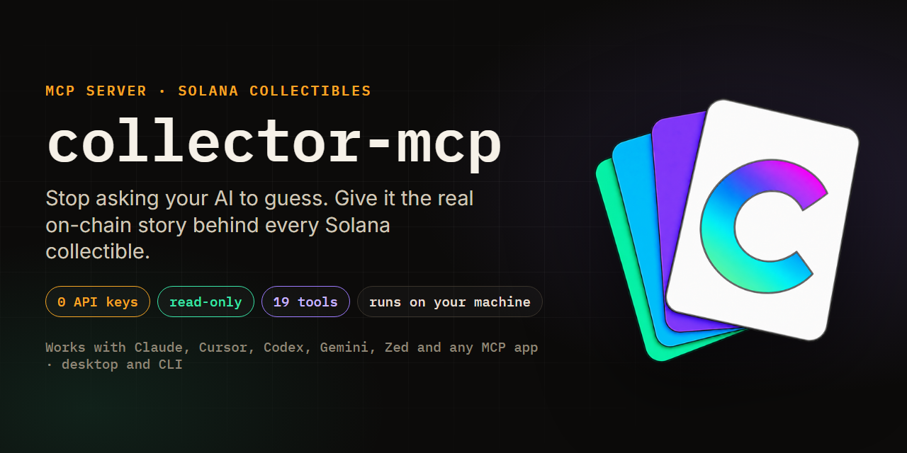
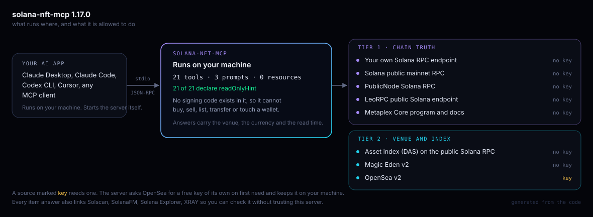

<div align="center">



# solana-nft-mcp

**The NFT APIs I tried return an empty ownership history for a Metaplex Core asset, and an AI reading that empty answer tells you the card has never traded.** solana-nft-mcp reads the chain itself: who owned it, who can freeze it, what sold and for how much, and where the deals are. Read-only, no sign-up, nothing collected, runs on your machine.

[](https://github.com/p1xelapp/solana-nft-mcp/blob/main/tsconfig.json)
[](https://modelcontextprotocol.io)
[](https://github.com/p1xelapp/solana-nft-mcp/blob/main/LICENSE)
[](#what-it-reads)

</div>

---

## Why

Ask an assistant about a Solana card today and it answers from memory. It will say a card
"never traded", because the mainstream NFT APIs return an empty history for Metaplex Core
assets while the transfers sit on chain the whole time. It will compare two floors quoted in
two currencies as if they were one.

solana-nft-mcp hands the same assistant live, labelled data instead: the chain for supply,
ownership, provenance and custody rules, Magic Eden without a key, and OpenSea through a free
key the server issues itself. Each number comes back with its marketplace, its currency, its
read time, and what the source could not see.



The server runs on your machine and your AI app starts it. There is no hosted service and no
account between you and the data. The picture is generated from the running server, so the
counts cannot drift from the code: `npm test` fails if they do.

## Install

Node 22 or newer. Build once:

```bash
git clone https://github.com/p1xelapp/solana-nft-mcp.git
cd solana-nft-mcp && npm install && npm run build
```

**Claude Code**

```bash
claude mcp add solana-nft -- node /absolute/path/to/solana-nft-mcp/dist/index.js
```

**Claude Desktop.** Settings -> Developer -> Edit Config, add the block below, then quit the
app fully and reopen it. Or install the `.mcpb` bundle from the latest release by dragging it
onto Settings -> Extensions.

```json
{
  "mcpServers": {
    "solana-nft": {
      "command": "node",
      "args": ["/absolute/path/to/solana-nft-mcp/dist/index.js"]
    }
  }
}
```

**Other clients.** Tested: Claude Desktop, Claude Code, Codex CLI 0.153.4
(`codex exec -c 'mcp_servers.solana-nft.command="node"' -c 'mcp_servers.solana-nft.args=["/absolute/path/to/dist/index.js"]'`).
Cursor, Windsurf, Gemini CLI, Zed, Cline and VS Code take the same `command` / `args` pair in
their own config; the server is plain stdio with no client-specific code, but those have not
been tested here. ChatGPT on the web and Grok cannot run a local process.

**Did it work?** Your app lists the tools near the message box (Claude Code: `/mcp`). You should
see 21, starting with `identify`. If none: the path must be absolute and end in `dist/index.js`,
`npm run build` must have run, and the app must be fully quit and reopened.

**OpenSea** is on without any setup. The first question that needs it makes the server ask
OpenSea for a free agent key, stored at `~/.solana-nft-mcp/opensea-key.json` and renewed before it
expires. The key is never logged or printed into an answer. A collection's OpenSea slug is found
from its on-chain address, or by name and then proved against that address; pass `openseaSlug`
to override. Options, set in the config's `env` block (clients launch the server with a clean
environment):

- `OPENSEA_API_KEY` - your own key, overrides the self-issued one.
- `SOLANA_NFT_MCP_NO_AUTO_KEYS=1` - never request a key; OpenSea is off unless you set one.
- `SOLANA_RPC_URL`, `DAS_RPC_URL` - a private endpoint, neither required. A key in the URL is
  registered and redacted from every answer (details in [docs/FAQ.md](https://github.com/p1xelapp/solana-nft-mcp/blob/main/docs/FAQ.md)).
- `SOLANA_NFT_MCP_NO_UPDATE_CHECK=1` - skip the one startup request to npm for a newer version.

## Ask it anything

Nobody types a tool name. These are asked in plain words and the assistant picks the calls.

- Who has owned this card since it was minted, with dates and the marketplaces involved?
- Is it true this card has never traded?
- Can the project still freeze, move or burn what is in my wallet?
- What is in wallet 7HHs3..., and does that wallet flip or hold?
- What is the cheapest Legendary listing in that DC collection right now?
- Any Superman or Batman DC comic #1 or #100 for sale, and are any close to floor?
- What did Shohei Ohtani cards sell for this week, and how many changed hands?
- Are the Magic Eden and OpenSea floors for this collection even comparable?
- What would it take to build a sales bot on this, and where would it fail quietly?

A collection name, a player name, a card number or a trait is enough to start. Names resolve
against a bundled snapshot of the Magic Eden directory, against OpenSea's Solana index, and
against the marketplace itself, and a fuzzy match is offered as a candidate with the mismatch
stated, never presented as the answer. Long answers are sized to arrive whole: a client that
caps a tool result gets fewer per-row details before it gets fewer rows, and the answer says
what it left out.

## What it reads

| Source | Answers | Key |
|---|---|---|
| Solana RPC (three public endpoints, rotated) | supply, current owner from decoded Core account bytes, transfer history, wallet age | none |
| Asset index (DAS) on the public RPC | a second, independent opinion on ownership and wallet contents | none |
| Magic Eden v2 | floors, listings, sales, activity, top traders, trending | none |
| OpenSea v2 | second-marketplace floors, sales, supply, royalty, wallet transfers | self-issued |

No account, no sign-in, no telemetry, no log of your questions, and no signing code anywhere in
the repository; every tool declares `readOnlyHint`. What leaves the machine: the public address,
symbol or name you asked about, sent to the source that can answer it; one startup request to
npm for the latest version number; one request to OpenSea for a free key, the first time a
question needs it. One file is written, the key file above, at permissions 600. Nothing else
touches disk. To remove everything: uninstall or delete the clone, then delete
`~/.solana-nft-mcp/`.

## Tools

21 tools. Names are frozen: agents reference them in prompts, and a rename breaks integrations
without raising an error.

| Tool | Back |
|---|---|
| `identify` | what an address or name is, where it trades, which tool to call next |
| `verify_claim` | confirmed, contradicted or unverifiable, with the numbers seen and how to re-check |
| `get_asset_trust` | Core plugins decoded from bytes: delegates, frozen state, enforced vs advisory royalties, mutable metadata, editions |
| `get_integration_recipe` | endpoints, pacing, running cost, skeleton and the silent failure modes for a given build |
| `search_collections` | name lookup across the Magic Eden directory and the OpenSea Solana index, saying which layers were read |
| `get_collection_stats` | chain supply, floors per marketplace, and a reconciliation that refuses to rank SOL against USDC |
| `get_collection_holders` | census of a Core collection from the chain's asset index, each holder with a role (issuer, marketplace escrow, wallet), capped and saying so |
| `get_floor_prices` | current floor and listed count for up to 10 collections, Magic Eden only |
| `get_recent_sales` | latest completed fills with buyer, seller, price, mint and signature |
| `get_asset` | three readers for one item: the marketplace, a byte-level decode, and the chain's asset index, with owner agreement reported |
| `get_asset_provenance` | bounded ownership history of a Core asset, dated, marketplaces named, every unread hole marked in place. `historyComplete` says every transaction was read; `mintObserved` says the mint itself was decoded. They are different claims |
| `get_wallet_holdings` | holdings from two independent readers, with the gap between them named |
| `get_wallet_profile` | holdings by collection, share of wallet and of supply, listed and compressed counts, floor ceiling with assumptions, wallet age |
| `get_wallet_activity` | buys and sells, net flow, marketplace split, every flip with hold time and P&L, a behaviour label with its reason |
| `get_collection_sales` | sales over a window: count, volume, median, buyers, sellers, per-day series, per-name breakdown, how far back the feed was read |
| `find_in_group` | one edition number hunted across a whole family of collections, each match against its own floor |
| `find_listings` | cheapest-first listings, trait filters, a name filter that says what it matched, a lowest-serials mode, each ask against its trait floor on both marketplaces |
| `get_top_traders` | the largest wallets in a collection by Magic Eden volume |
| `get_trending` | Magic Eden's trending list, with an explicit note when the marketplace publishes nothing |
| `explain_mechanics` | escrow, freezing, delegates, royalties, wash trades and migrations, per standard and marketplace, each entry citing its source |
| `get_source_status` | every source pinged live: tier, fallback, what it cannot see, credential state |

Three prompts: `getting_started`, `collection_report`, `wallet_report`. No MCP resources, on
purpose: everything they would carry is reachable by a tool the assistant calls itself.

## Trust and limits

- Buying, selling, listing and signing are absent. No code exists for them.
- Provenance and trust decoding cover Metaplex Core only. Legacy SPL and compressed NFTs are
  reported as named gaps, never as empty lists. Holdings and activity cover both.
- Magic Eden and OpenSea only. Tensor has no self-serve keys; Rarible's Solana coverage is
  unconfirmed. Both are catalogued with the condition that would add them.
- Every money figure names its currency and the API it came from, on the summary and on every
  priced row, and counts keep their coverage flags beside them (`truncated`, `stale`,
  `historyComplete`). A program should refuse to act on a row whose flag says the read was partial.
- Two error surfaces. Input that fails a tool's schema is refused before the handler runs:
  `isError: true`, no `structuredContent`. Every failure inside a handler carries
  `structuredContent.error`, a stable category (`not-found`, `wrong-kind`, `escrow`,
  `source-unsupported`, `bad-input`, `upstream-unavailable`, `upstream-rate-limit`, `error`).
- No valuations and no currency conversion. Solana only.

Full detail: [docs/TRUST-AND-LIMITS.md](https://github.com/p1xelapp/solana-nft-mcp/blob/main/docs/TRUST-AND-LIMITS.md).

## Security

Minting is permissionless, so a collection name is attacker-controlled text. Every name and every
field from a chain or a marketplace is checked against the shape it claims to have before a model
sees it, and every credential this process has sent is redacted from every answer. Covered by the
offline suite. Reporting: [SECURITY.md](https://github.com/p1xelapp/solana-nft-mcp/blob/main/SECURITY.md).

## Development

```bash
npm test           # offline: every tool, prompt, validation, wallet and market logic,
                   # the OpenSea contract, the prompt-injection defence. No network.
npm run test:live  # live: floors, a real provenance trace, source status, name lookup
npm run snapshot   # refresh the bundled Magic Eden collection directory
npm run inspect    # open the MCP Inspector against a local build
```

CI runs a full-history secrets scan on every push to every branch; the offline suite, lint, the
tarball check and `npm audit` on `main`, pull requests and release tags; and the live check weekly.

## Docs

- [Under the hood: why it exists, how it works, what was tested](https://github.com/p1xelapp/solana-nft-mcp/blob/main/docs/DEEP-DIVE.md)
- [Every data source, tiered](https://github.com/p1xelapp/solana-nft-mcp/blob/main/docs/SOURCES.md)
- [Questions people ask, and which ones it can answer](https://github.com/p1xelapp/solana-nft-mcp/blob/main/docs/QUESTIONS.md)
- [Fifteen ways people use it](https://github.com/p1xelapp/solana-nft-mcp/blob/main/docs/HOW-PEOPLE-USE-IT.md) and [things people build with it](https://github.com/p1xelapp/solana-nft-mcp/blob/main/docs/BUILD-IDEAS.md)
- [What can change under this server](https://github.com/p1xelapp/solana-nft-mcp/blob/main/docs/MAINTENANCE.md), [FAQ](https://github.com/p1xelapp/solana-nft-mcp/blob/main/docs/FAQ.md), [Contributing](https://github.com/p1xelapp/solana-nft-mcp/blob/main/CONTRIBUTING.md)

## About

Built and maintained by P1xel ([p1xel.app](https://p1xel.app),
[@P1xelCollector](https://x.com/P1xelCollector)), a long-time Solana collector. The Core
decoding was written first for [CandyScan](https://candyscan.p1xel.app), which tracks the Candy
Digital collections; this repository is the keyless half of that pipeline. The story of why it
exists is in [docs/DEEP-DIVE.md](https://github.com/p1xelapp/solana-nft-mcp/blob/main/docs/DEEP-DIVE.md).

**Independent project, not affiliated with the Solana Foundation.** SOLANA and SOL are trademarks
of the Solana Foundation. They appear in this project's name and documentation for one reason
only: to say which chain the server reads. Nothing here is endorsed, sponsored or reviewed by the
Solana Foundation, and no affiliation is claimed or implied.

## License

MIT. See [LICENSE](https://github.com/p1xelapp/solana-nft-mcp/blob/main/LICENSE).
